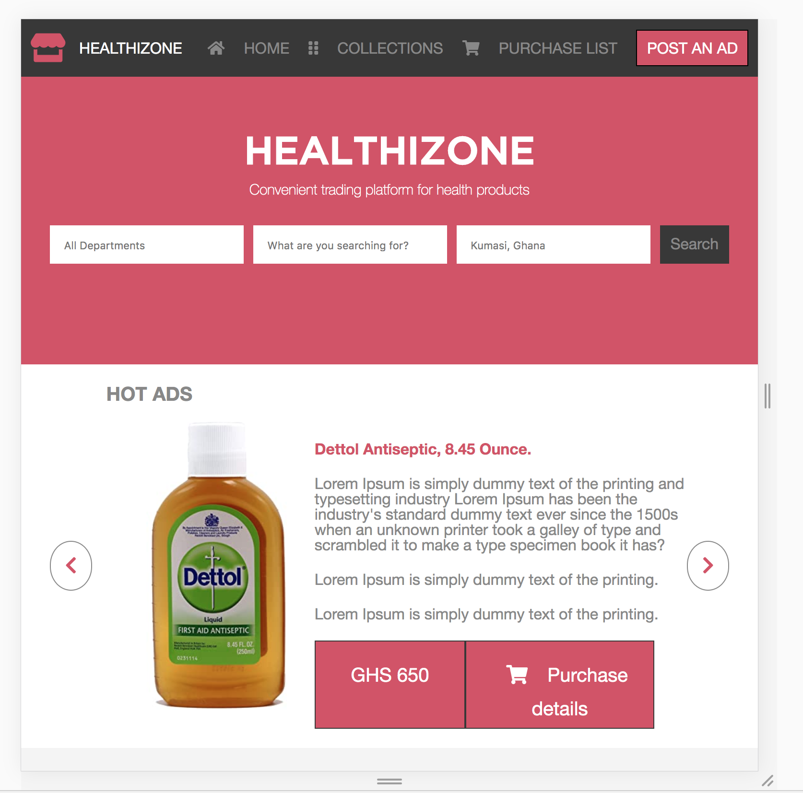

# healthi-zone
This is the Microverse HTML &amp; CSS capstone project. This capstone microverse project consists of building a real-world-like project, built with business specifications.

Additional description about the project and its features.
In this Microverse capstone project, I was required to build a personalized online shop having been given design specifications. 
With this in mind, I decided to build an online health shop.
It has two pages; one for the home page and the other for the search results page.
The project also required building versions for 2 different screen sizes (i.e mobile and tablet/desktop).

## Built With

- Html
- CSS

## Live Demo

[Live Demo Link](https://rawcdn.githack.com/krys2fa/healthi-zone/a93053d4365719df7944ac0175baad718df569e9/index.html)

## Getting Started

**Click on the link above in order to see the Live Demo of the front end project.**

To get a local copy up and running follow these simple example steps.

### Prerequisites

- Web Browser
- Text Editor

### Setup

- Download repository files

## Author

👤 **Christopher Amanor**

- Github: [@krys2fa](https://github.com/krys2fa)
- Twitter: [@krys2fa](https://twitter.com/krys2fa)
- Linkedin: [Christopher Amanor](https://www.linkedin.com/in/christopher-amanor-81a7b93b/)

## 🤝 Contributing

Contributions, issues and feature requests are welcome!

Feel free to check the [issues page](issues/).

## Show your support

Give a ⭐️ if you like this project!

## Acknowledgments

- Hat tip to [Mohammed Awad](https://www.behance.net/M_Awad) whose [design inspiration](https://www.behance.net/gallery/24796463/ZATTIX) was used in this project.

## 📝 License

This project is [MIT](lic.url) licensed.
